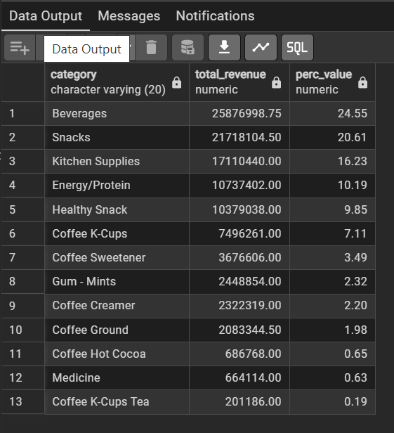
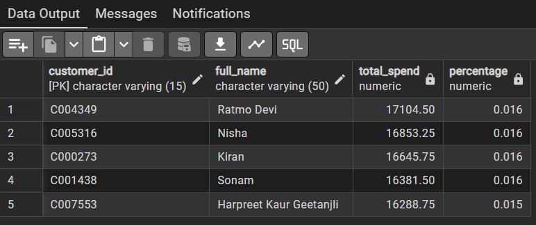
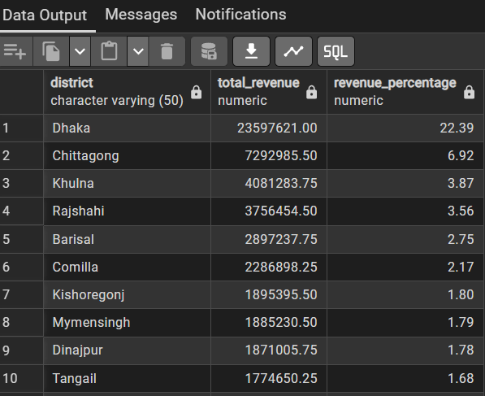
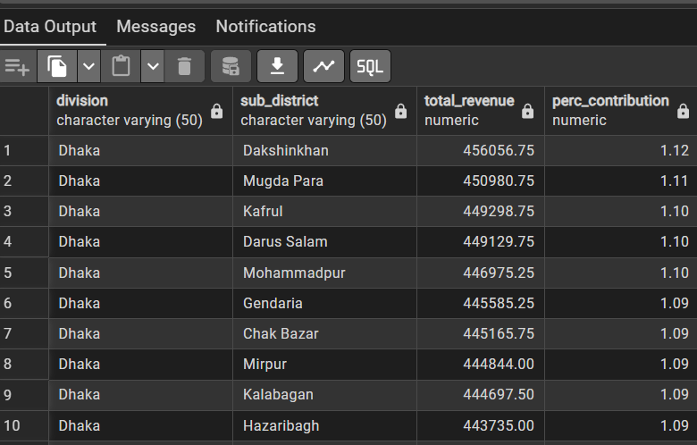
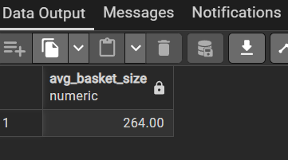

# Retail Sales Analysis – SQL Project (Bangladesh Retail Stores)

**Executive Summary**  
End-to-end SQL analysis of multi-store retail sales data across Bangladesh.  
Reveals key revenue drivers, customer behavior patterns, geographic concentration risks, seasonality trends, payment preferences, inventory health, and operational optimization opportunities.  
Addresses **20 real business questions** with advanced SQL + stakeholder-ready insights, impacts & recommendations.

## Project Overview

- **Dataset**: Retail sales fact table + dimensions  
  (fact_table, time, customer, store, item, trans)  
- **Objective**: Turn transaction data into actionable business intelligence  
- **Tools Used**:
  - PostgreSQL  
  - Advanced SQL (Joins, CTEs, Window Functions, Aggregations)  
- **Key skills demonstrated**:  
  Business-oriented querying • Insight generation • Risk identification • Actionable recommendation writing

## Key Business Questions & Insights (Top 20 Highlights)

1. **Total Revenue by Category**  
   Beverages → **24.55%** of total revenue (dominant)  
   → High concentration risk → Protect supply chain + promote diversification  
   

2. **Top 5 Customers by Total Spend**  
   Clear VIP segment with outsized contribution  
   → Launch loyalty program + personalized retention  
   

3. **Payment Method Popularity**  
   Card dominates revenue & shows higher ATV  
   → Secure digital infrastructure + negotiate lower fees

4. **Sales by District**  
   Dhaka → **~22.39%** of total revenue (3× second place)  
   → Extreme geographic dependency → Protect Dhaka + expand to Chittagong etc.  
   

5. **Monthly Revenue Trend (2017)**  
   Strong seasonality visible  
   → Replicate peak drivers + promote slow months

6. **Top 5 Most Sold Items (by Quantity)**  
   Top items show strong daily demand & high turnover  
   → Ensure availability + bundle with slow-movers  
   

7. **Average Transaction Value by Payment Type**  
   Digital payments show higher ATV than cash  
   → Incentivize high-ATV methods

8. **Supplier Performance**  
   Few suppliers generate majority of revenue  
   → Negotiate better terms + diversify base

9. **Peak Sales Hour (Revenue)**  
   One hour generates maximum revenue  
   → Align staff shifts with peak hours

10. **Regional Breakdown (Division + District)**  
    Revenue heavily concentrated in certain regions  
    → Replicate top-region strategy + regional marketing

11. **Year-over-Year Revenue Growth**  
    Calculated % change vs previous year  
    → Investigate slowdowns + accelerate expansion if needed

12. **Most Frequent Shoppers (by Transaction Count)**  
    Some customers show strong behavioral loyalty  
    → Frequency-based rewards + subscription model

13. **Global Sourcing (Country Performance)**  
    Some countries drive more revenue  
    → Focus on high-revenue countries + evaluate cost

14. **Top 5 Banks (Card Transactions)**  
    Top banks contribute majority of card revenue  
    → Collaborate on cashback + negotiate lower MDR

15. **Slow-Moving Items (Bottom 10)**  
    Several products have very low sales volume  
    → Discount/bundle + consider discontinuation

16. **Category Revenue by Quarter**  
    Clear quarterly seasonality in some categories  
    → Seasonal forecasting + align marketing

17. **Dhaka Division – Sub-district Breakdown**  
    Revenue concentrated in few sub-districts  
    → Replicate top sub-districts + localized promotions  
    

18. **Packaging Impact (Cans vs Bottles)**  
    Container type affects quantity & price  
    → Focus promotion on preferred format

19. **Average Basket Size**  
    Average number of different items per transaction  
    → Introduce combo offers + recommendation engine  
    

20. **Peak Transaction Hour (by Count)**  
    One hour sees highest transaction volume  
    → Data-driven staffing + senior staff at peak

## SQL Queries
All 20 analyses are available as individual, well-commented `.sql` files:  
01_revenue_by_category.sql  
02_top_5_customers.sql  
03_payment_method_popularity.sql  
04_sales_by_district.sql  
05_monthly_revenue_2017.sql  
06_top_5_items_by_quantity.sql  
07_avg_transaction_value_by_payment.sql  
08_supplier_performance.sql  
09_peak_revenue_hour.sql  
10_regional_breakdown.sql  
11_year_over_year_growth.sql  
12_most_frequent_customers.sql  
13_country_performance.sql  
14_top_5_banks_card.sql  
15_slow_moving_items.sql  
16_category_by_quarter.sql  
17_dhaka_subdistrict_breakdown.sql  
18_packaging_impact.sql  
19_average_basket_size.sql  
20_peak_transaction_hour.sql

## What This Project Demonstrates
- Strong PostgreSQL & advanced SQL skills
- Ability to translate data into **business language**
- Risk-aware thinking (concentration, dependency, seasonality)
- Stakeholder-focused recommendations
- Clean, reproducible project structure

## Next Steps (Planned)
- Add more result screenshots / sample output tables
- Build interactive dashboard (Looker Studio or Power BI)
- Add Python layer (pandas EDA + basic visualizations)
- Include data quality / cleaning notes

Feel free to clone, run, or fork!  
Questions / feedback → open an issue.

Last updated: March 2026  
Built by: ANJU KRISHNA E
