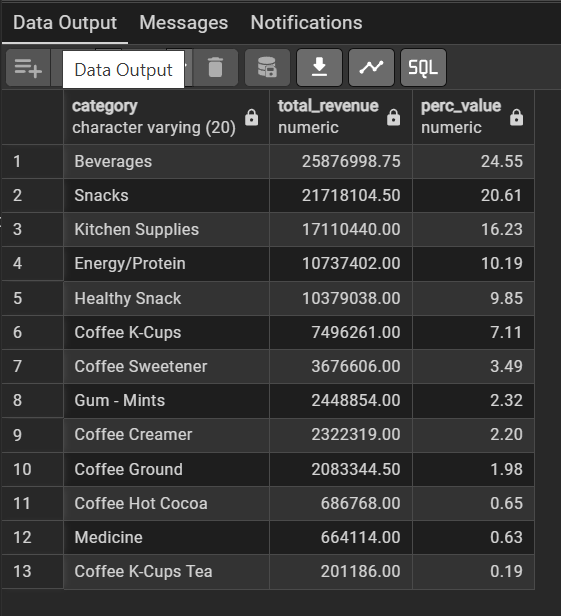
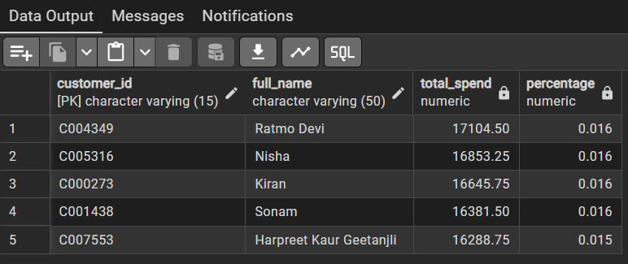
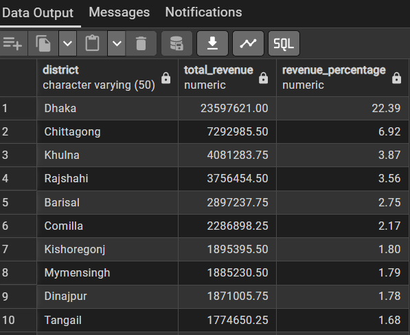
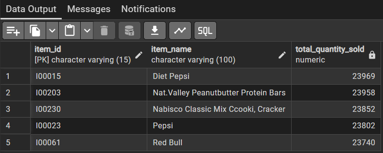
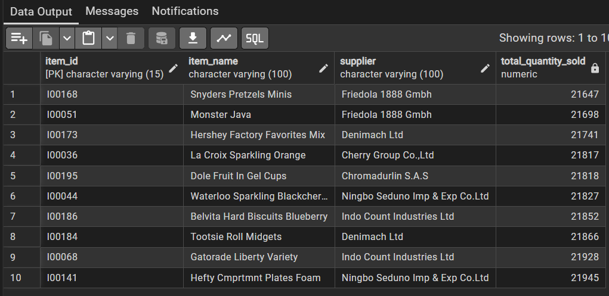
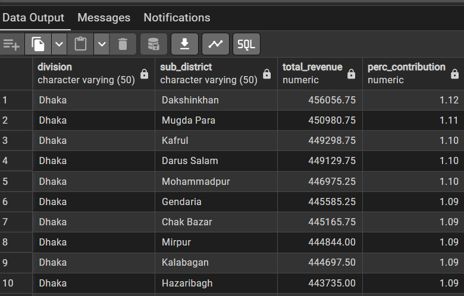
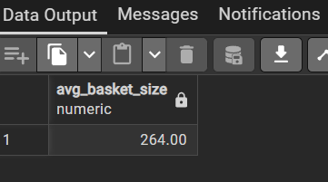

# Bangladesh Retail Sales Analysis – SQL + Power BI Project

End-to-end retail analytics project using PostgreSQL (SQL) and Power BI dashboard on Bangladesh retail sales data.

Reveals revenue drivers, geographic concentration, payment preferences, category dominance, and operational insights.

Includes 20 business-focused SQL queries + interactive Power BI dashboard with transparent data quality note.

## Important Data Quality Note

**Dataset limitations** (transparently documented):
- Only **264 unique products** (`item_id`) across ~1 million rows
- Only **39 unique payments** (`payment_id`)
- Every transaction contains **all 264 items** (heavy duplication / data generation artifact)
- Result: Average basket size = **264** (unrealistic – real retail is typically **2–5 items**)

**Valid insights remain**:
- Revenue concentration (Beverages 24.55%, Dhaka 22.39%)
- Card payment dominance (~89.74%)
- Geographic & category trends
- Payment & supplier patterns

In production I would clean duplicates, re-import, or request better data.

## Project Overview

**Objective**: Transform transaction data into actionable business intelligence.

**Tools & Skills**:
- PostgreSQL / pgAdmin – data modeling & querying
- Advanced SQL: Joins, CTEs, Window functions, Aggregations
- Power BI Desktop – interactive dashboard & KPIs
- Business storytelling: insights + impact + recommendations

**Key KPIs (from Power BI)**:
- Total Revenue: **105.40M**
- Card Revenue Share: **89.74%**
- Beverages Revenue Share: **24.55%**
- Dhaka Revenue Share: **22.39%**

## Live Power BI Dashboard

Interactive public version:

[View Bangladesh Retail Sales Dashboard →](https://app.powerbi.com/view?r=your_embedded_link_here_if_published)

**Features**:
- 4 main KPIs with real-time formatting
- Revenue by category (bar chart)
- Revenue by payment type (donut chart)
- Top 10 districts by revenue (bar chart)
- Category & district slicers for filtering
- Clear data quality note

**Screenshots**:

  
*(Add 1–3 screenshots in /images/ folder)*

## SQL Queries (20 Business Questions)

All queries are in the `/sql` folder as individual, commented `.sql` files.

| #  | Query Name                                | File Name                                      | Key Insight / Business Question                     |
|----|-------------------------------------------|------------------------------------------------|-----------------------------------------------------|
| 1  | Total Revenue by Category                 | 01_revenue_by_category.sql                     | Category contribution & concentration risk          |
| 2  | Top 5 Customers by Spend                  | 02_top_5_customers.sql                         | VIP segment & loyalty opportunity                   |
| 3  | Payment Method Popularity                 | 03_payment_method_popularity.sql               | Card dominance & digital preference                 |
| 4  | Sales by District                         | 04_sales_by_district.sql                       | Geographic revenue distribution                     |
| 5  | Monthly Revenue Trend 2017                | 05_monthly_revenue_2017.sql                    | Seasonality & peak drivers                          |
| ...| ...                                       | ...                                            | ...                                                 |
| 19 | Average Basket Size                       | 19_average_basket_size.sql                     | Cross-selling strength (with data note)             |
| 20 | Peak Transaction Hour (by Count)          | 20_peak_transaction_hour.sql                   | Busiest hour for staffing & operations              |

Full list of 20 queries with business insights is in the `/sql` folder.

## Repository Structure

retail-sales-bangladesh/
├── sql/
│   ├── 01_revenue_by_category.sql
│   ├── 02_top_5_customers.sql
│   └── ... (20 files)
├── images/
│   ├── dashboard-full.png
│   └── (other screenshots)
├── Bangladesh Retail Sales Dashboard.pbix
├── README.md
└── (other files)

## How to Use

1. **SQL part**  
   Import dataset into PostgreSQL → run queries in pgAdmin or any SQL client.

2. **Power BI part**  
   Download `.pbix` file → open in Power BI Desktop → refresh if needed.

3. **Explore**  
   Use category & district slicers in the dashboard to filter visuals.

## Next Steps (Planned)

- Add more visuals (time trends, customer segmentation)
- Python layer (pandas EDA, matplotlib/seaborn plots)
- Data cleaning notebook (deduplication & cardinality fix)
- Deployment (Power BI Service report + scheduled refresh)

## License

MIT License – free to use for learning and portfolio purposes.

---

Built by **ANJU KRISHNA E**  
Kozhikode, Kerala  
March 2026

# Retail Sales Analysis – SQL Project (Bangladesh Retail Stores)

**Executive Summary**  
End-to-end SQL analysis of multi-store retail sales data across Bangladesh.  
Reveals key revenue drivers, customer behavior patterns, geographic concentration risks, seasonality trends, payment preferences, inventory health, and operational optimization opportunities.  
Addresses **20 real business questions** with advanced SQL + stakeholder-ready insights, impacts & recommendations.

## Important Data Quality Note

This dataset has the following characteristics:
- Only **264 unique products** (`item_id`) across the entire 1,000,000 rows
- Only **39 unique payments** (`payment_id`)
- As a result, every transaction includes **all 264 items** (due to heavy duplication in the data generation/import process)

This leads to:
- Average basket size = **264** (unrealistic – real retail averages are typically 2–5 distinct items per transaction)
- Some metrics appear inflated or capped

The analysis remains valid for:
- Revenue concentration (e.g. Beverages 24.55%, Dhaka 22.39%)
- Geographic trends
- Payment preferences (Card ~89.74%)
- Inventory & supplier insights

In a real project, I would clean duplicates, re-import, or request better data. This limitation is documented transparently as part of the learning process.

Feedback on handling data issues is welcome!

## Project Overview

- **Dataset**: Retail sales fact table + dimensions  
  (fact_table, time, customer, store, item, trans)  
- **Objective**: Turn transaction data into actionable business intelligence  
- **Tools Used**:
  - PostgreSQL  
  - Advanced SQL (Joins, CTEs, Window Functions, Aggregations)  
- **Key skills demonstrated**:  
  Business-oriented querying • Insight generation • Risk identification • Actionable recommendation writing

## Key Business Questions & Insights (Top 20 Highlights)

1. **Total Revenue by Category**  
   Beverages → **24.55%** of total revenue (dominant)  
   → High concentration risk → Protect supply chain + promote diversification  
   

2. **Top 5 Customers by Total Spend**  
   Clear VIP segment with outsized contribution  
   → Launch loyalty program + personalized retention  
   

3. **Payment Method Popularity**  
   Card dominates revenue & shows higher ATV  
   → Secure digital infrastructure + negotiate lower fees

4. **Sales by District**  
   Dhaka → **~22.39%** of total revenue (3× second place)  
   → Extreme geographic dependency → Protect Dhaka + expand to Chittagong etc.  
   

5. **Monthly Revenue Trend (2017)**  
   Strong seasonality visible  
   → Replicate peak drivers + promote slow months

6. **Top 5 Most Sold Items (by Quantity)**  
   Top items show strong daily demand & high turnover  
   → Ensure availability + bundle with slow-movers  
   

7. **Average Transaction Value by Payment Type**  
   Digital payments show higher ATV than cash  
   → Incentivize high-ATV methods

8. **Supplier Performance**  
   Few suppliers generate majority of revenue  
   → Negotiate better terms + diversify base

9. **Peak Sales Hour (Revenue)**  
   One hour generates maximum revenue  
   → Align staff shifts with peak hours

10. **Regional Breakdown (Division + District)**  
    Revenue heavily concentrated in certain regions  
    → Replicate top-region strategy + regional marketing

11. **Year-over-Year Revenue Growth**  
    Calculated % change vs previous year  
    → Investigate slowdowns + accelerate expansion if needed

12. **Most Frequent Shoppers (by Transaction Count)**  
    Some customers show strong behavioral loyalty  
    → Frequency-based rewards + subscription model

13. **Global Sourcing (Country Performance)**  
    Some countries drive more revenue  
    → Focus on high-revenue countries + evaluate cost

14. **Top 5 Banks (Card Transactions)**  
    Top banks contribute majority of card revenue  
    → Collaborate on cashback + negotiate lower MDR

15. **Slow-Moving Items (Bottom 10)**  
    Several products have very low sales volume  
    → Discount/bundle + consider discontinuation
    
    
17. **Category Revenue by Quarter**  
    Clear quarterly seasonality in some categories  
    → Seasonal forecasting + align marketing

18. **Dhaka Division – Sub-district Breakdown**  
    Revenue concentrated in few sub-districts  
    → Replicate top sub-districts + localized promotions  
    

19. **Packaging Impact (Cans vs Bottles)**  
    Container type affects quantity & price  
    → Focus promotion on preferred format

20. **Average Basket Size**  
    Average number of different items per transaction  
    → Introduce combo offers + recommendation engine  
    

21. **Peak Transaction Hour (by Count)**  
    One hour sees highest transaction volume  
    → Data-driven staffing + senior staff at peak

## SQL Queries
All 20 analyses are available as individual, well-commented `.sql` files:  

01_revenue_by_category.sql  
02_top_5_customers.sql  
03_payment_method_popularity.sql  
04_sales_by_district.sql  
05_monthly_revenue_2017.sql  
06_top_5_items_by_quantity.sql  
07_avg_transaction_value_by_payment.sql  
08_supplier_performance.sql  
09_peak_revenue_hour.sql  
10_regional_breakdown.sql  
11_year_over_year_growth.sql  
12_most_frequent_customers.sql  
13_country_performance.sql  
14_top_5_banks_card.sql  
15_slow_moving_items.sql  
16_category_by_quarter.sql  
17_dhaka_subdistrict_breakdown.sql  
18_packaging_impact.sql  
19_average_basket_size.sql  
20_peak_transaction_hour.sql

## What This Project Demonstrates
- Strong PostgreSQL & advanced SQL skills
- Ability to translate data into **business language**
- Risk-aware thinking (concentration, dependency, seasonality)
- Stakeholder-focused recommendations
- Clean, reproducible project structure

## Next Steps (Planned)
- Add more result screenshots / sample output tables
- Build interactive dashboard (Looker Studio or Power BI)
- Add Python layer (pandas EDA + basic visualizations)
- Include data quality / cleaning notes

Feel free to clone, run, or fork!  
Questions / feedback → open an issue.

Last updated: March 2026  
Built by: ANJU KRISHNA E
