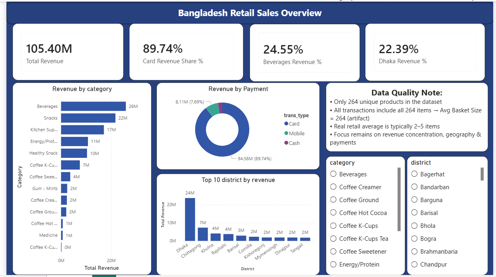

# Bangladesh Retail Sales Analysis – SQL + Power BI Project

End-to-end retail analytics project using PostgreSQL (SQL) and Power BI dashboard on Bangladesh retail sales data.

Reveals revenue drivers, geographic concentration, payment preferences, category dominance, and operational insights.

Includes 20 business-focused SQL queries + interactive Power BI dashboard with transparent data quality note.

## Important Data Quality Note

**Dataset limitations** (transparently documented):
- Only **264 unique products** (`item_id`) across ~1 million rows
- Only **39 unique payments** (`payment_id`)
- Every transaction contains **all 264 items** (heavy duplication / data generation artifact)
- Result: Average basket size = **264** (unrealistic – real retail is typically **2–5 items**)

**Valid insights remain**:
- Revenue concentration (Beverages 24.55%, Dhaka 22.39%)
- Card payment dominance (~89.74%)
- Geographic & category trends
- Payment & supplier patterns

In production I would clean duplicates, re-import, or request better data.

## Project Overview

**Objective**: Transform transaction data into actionable business intelligence.

**Tools & Skills**:
- PostgreSQL / pgAdmin – data modeling & querying
- Advanced SQL: Joins, CTEs, Window functions, Aggregations
- Power BI Desktop – interactive dashboard & KPIs
- Business storytelling: insights + impact + recommendations

**Key KPIs (from Power BI)**:
- Total Revenue: **105.40M**
- Card Revenue Share: **89.74%**
- Beverages Revenue Share: **24.55%**
- Dhaka Revenue Share: **22.39%**

## Live Power BI Dashboard

**Interactive public version** (if published):  
[View Dashboard on Power BI Service](https://app.powerbi.com/view?r=your_link_here_if_published)

**Features**:
- 4 main KPIs with real-time formatting
- Revenue by category (bar chart)
- Revenue by payment type (donut chart)
- Top 10 districts by revenue (bar chart)
- Category & district slicers for filtering
- Clear data quality note

**Download Power BI file**:  
[Download Bangladesh Retail Sales Dashboard.pbix](Bangladesh Retail Sales Dashboard.pbix)

## Screenshots

## SQL Queries (20 Business Questions)

All queries are in the `/sql` folder as individual, commented `.sql` files.

| #  | Query Name                                | File Name                                      | Key Insight / Business Question                     |
|----|-------------------------------------------|------------------------------------------------|-----------------------------------------------------|
| 1  | Total Revenue by Category                 | 01_revenue_by_category.sql                     | Category contribution & concentration risk          |
| 2  | Top 5 Customers by Spend                  | 02_top_5_customers.sql                         | VIP segment & loyalty opportunity                   |
| 3  | Payment Method Popularity                 | 03_payment_method_popularity.sql               | Card dominance & digital preference                 |
| 4  | Sales by District                         | 04_sales_by_district.sql                       | Geographic revenue distribution                     |
| 5  | Monthly Revenue Trend 2017                | 05_monthly_revenue_2017.sql                    | Seasonality & peak drivers                          |
| ...| ...                                       | ...                                            | ...                                                 |
| 19 | Average Basket Size                       | 19_average_basket_size.sql                     | Cross-selling strength (with data note)             |
| 20 | Peak Transaction Hour (by Count)          | 20_peak_transaction_hour.sql                   | Busiest hour for staffing & operations              |

Full list of 20 queries with business insights is in the `/sql` folder.

## Repository Structure

retail-sales-bangladesh/
├── sql/
│   ├── 01_revenue_by_category.sql
│   ├── 02_top_5_customers.sql
│   └── ... (20 files)
├── images/
│   ├── dashboard-full.png
│   └── (other screenshots)
├── Bangladesh Retail Sales Dashboard.pbix
├── README.md
└── (other files)

## How to Use

1. **SQL part**  
   Import dataset into PostgreSQL → run queries in pgAdmin or any SQL client.

2. **Power BI part**  
   Download `.pbix` file → open in Power BI Desktop → refresh if needed.

3. **Explore**  
   Use category & district slicers in the dashboard to filter visuals.

## Next Steps (Planned)

- Add more visuals (time trends, customer segmentation)
- Python layer (pandas EDA, matplotlib/seaborn plots)
- Data cleaning notebook (deduplication & cardinality fix)
- Deployment (Power BI Service report + scheduled refresh)

## License

MIT License – free to use for learning and portfolio purposes.

---

Built by **ANJU KRISHNA E**  
Kozhikode, Kerala  
March 2026
